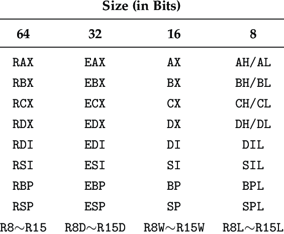

# JASM Regex Generator

## Run

To run the project it is recommended to do:

- `poetry shell`
- `poetry install`
- `pip install -r dev-requirements.txt`

This should allow to run `run_tests.sh`.

## Parse an assembly file

`python3 main.py -p <pattern.yaml> -s <assembly_file.s>`

## Parse a binary file

`python3 main.py -p <pattern.yaml> -b <binary_file.bin>`

## Help

To see the help run `python3 main.py -h` or `python3 main.py --help`

## Run tests

To run test you can,

- Run `sh run_tests.sh` while inside `poetry shell`.

- Another options is to simply call `pytest`

## Manual Rules

The rules for using in the patterns are as follows:

- `$and`: Matches all the command in the list

- `$or`: Matches any of the command in the list

- `$not`: Matches any command that is not in the list

- `$and_any_order`: Matches all the commands in the list in any order

- `@any`: Matches any command

- `$deref`: Used for dereferencing a register

NOTE: the `$deref` commands require the following syntax, using the example below:

```
    - $deref:
        main_reg: "%rax"
        constant_offset: "0x0"
        register_multiplier: "%rbx"
        constant_multiplier: 1


```

This would be transforming the objdump syntax into golbolt one:

k(a,b,c) -> [a+b*c+k]
objdump syntax -> jasm/golbolt syntax

where:

- `main_reg: a`

- `constant_multiplier: b`

- `register_multiplier: c`

- `constant_offset: k`

So the example would match a command like `nopw 0x0(%rax,%rbx,1)` turning it to `[%rax+%rbx*1+0x0]`

## Special registry capture groups

The x86 registers are the following:



we support the following convention for using special register captures.

Use the capture group special names for capturing the registers:

- `&genreg`

- `&indreg`

- `&stackreg`

- `&basereg`

And these suffix for accessing the specific parts of the registers:

- `.64`

- `.32`

- `.16`

- `.8H`

- `.8L`

So for example:

- if you want to capture the `rax` register you can use `&genreg.64` and it will capture the `rax` register.
- if you want to capture the `eax` register you can use `&genreg.32` and it will capture the `eax` register.
- if you want to capture the `ax` register you can use `&genreg.16` and it will capture the `ax` register.
- if you want to capture the `ah` register you can use `&genreg.8H` and it will capture the `ah` register.
- if you want to capture the `al` register you can use `&genreg.8L` and it will capture the `al` register.
